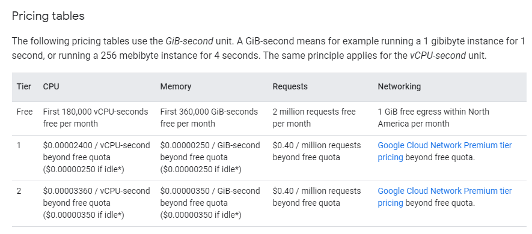
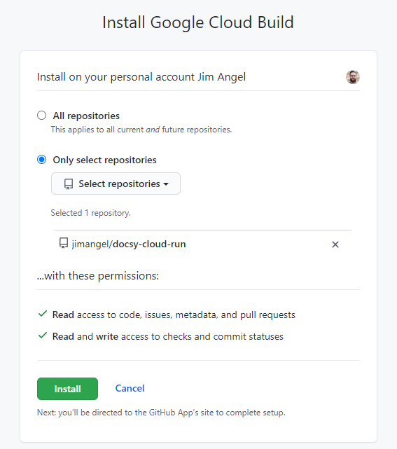
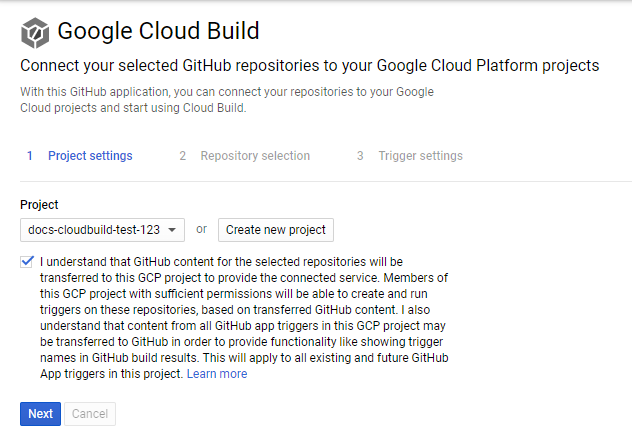
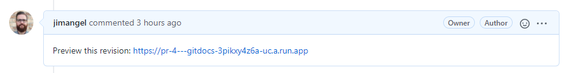

# Google Docs as Code

This guide covers:

- Setting up a docs repo
- Manually configure CI/CD using Cloud Build
    - Including auto-deploy to Cloud Run
- Adding a custom domain URL
- Automating future builds and PRs

This example repo is hosted it: https://cloudrun.gitdocs.dev

## Before Starting

Have a high level understanding of Cloud Build and Cloud Run. Cloud Build is a YAML based CI/CD system that instructs how we deploy and interact with Google Cloud. Cloud Run is a container service built on knative. Images will be stored in Google Container Registry (like DockerHub).

Cloud Build [pricing](https://cloud.google.com/cloud-build/pricing) is $0.003 a build-minute. The first 120 builds-minutes per day are free.

Cloud Run [pricing](https://cloud.google.com/run/pricing) has a free tier and CPU-second based charges:



Google Container Registry [pricing](https://cloud.google.com/container-registry/pricing) is the cost of [Cloud Storage Buckets](https://cloud.google.com/storage/pricing) (GCS) and [Networking egress](https://cloud.google.com/vpc/network-pricing#internet_egress).

## Fork this repo

This demo is based of the [docsy example site](https://github.com/google/docsy-example). Create a fork of this repository to be deployed in your own Google project. By creating a fork you can customize as needed.

```
git clone path-to-your-fork:username/<repo>
cd <repo>
```

For information on customizing and maintaining a docsy site please see the [official docs](https://www.docsy.dev/docs/adding-content/).

## GCP Setup

Create and `set` project. Setup billing if not completed already.

```
GC_PROJECT=docs-cloudbuild-test-123
gcloud projects create $GC_PROJECT
gcloud config set project $GC_PROJECT
```

Enable APIs.

```
gcloud services enable \
cloudbuild.googleapis.com \
run.googleapis.com
```

Set permissions on the Cloud Build service account.

```
GC_PROJECT=docs-cloudbuild-test-123

GC_PROJECT_NUMBER=$(gcloud projects list \
--filter="$GC_PROJECT" --format="value(PROJECT_NUMBER)")

# Grant the Cloud Run Admin role to the Cloud Build service account
gcloud projects add-iam-policy-binding $GC_PROJECT \
  --member "serviceAccount:$GC_PROJECT_NUMBER@cloudbuild.gserviceaccount.com" \
  --role roles/run.admin

# Grant the IAM Service Account User role to
# the Cloud Build service account on the Cloud Run runtime service account
gcloud iam service-accounts add-iam-policy-binding \
  $GC_PROJECT_NUMBER-compute@developer.gserviceaccount.com \
  --member="serviceAccount:$GC_PROJECT_NUMBER@cloudbuild.gserviceaccount.com" \
  --role="roles/iam.serviceAccountUser"
```

## Manually trigger Cloud Build

Running the following creates the container and deploys it under a random domain URL on Cloud Run. In subsequent steps we give it a custom domain and automate the build trigger.

> There's an [issue with .git directories](https://github.com/GoogleCloudPlatform/cloud-builders/issues/236) with Cloud Build that excludes `.git` folders which we avoid by disabling `gcloudignore`.

```
gcloud config set gcloudignore/enabled false
gcloud builds submit --substitutions _ENVIRONMENT="production"
```

## Add a custom domain

Check to see if the domain you want to use is already verified:

```
gcloud domains list-user-verified
```

If not, verify it by running the following commands. It opens up a web browser with instructions on using DNS and TXT records to verify your domain.

```
# swap with your domain
DOMAIN=gitdocs.dev

gcloud domains verify $DOMAIN
```

Add domain to Cloud Run:

```
# swap with your domain
DOMAIN=cloudrun.gitdocs.dev

gcloud beta run domain-mappings create \
--service gitdocs --domain $DOMAIN \
--region us-central1 --platform managed
```

If you mapped a sub domain it will give you a CNAME to add to DNS. If you mapped a top level domain, it will provide the IPs to add to add to DNS A records.

It could take 20+ minutes to take effect.

## Automate Cloud Build trigger

You can create triggers for GitHub or Cloud Source Repositories ([more info](https://cloud.google.com/cloud-build/docs/automating-builds/create-manage-triggers#build_trigger)). When it comes to integrating Cloud Build with GitHub, you have the option of doing it several ways. This demo uses the GitHub app. It's important to know various integrations exist when it comes to reading documentation, however all options can be mixed and matched.

## Install Cloud Build GitHub app.

This step is completed through the GUI. For detailed instructions see [Installing the Google Cloud Build app](https://cloud.google.com/cloud-build/docs/automating-builds/run-builds-on-github#installing_the_google_cloud_build_app).

- Go to https://github.com/marketplace/google-cloud-build
- Scroll down and click **Setup with Google Cloud Build** at the bottom of the page
- Follow the instructions to grant access to your repositories



- You are prompted for your GitHub password and redirected to the Google console login
- Review and authorize permissions
- In Google's Cloud Console, select a project



- Select a repo > Connect repository
- **Skip for now** when it comes to creating the trigger, that's done next via gcloud

### Create the trigger to build on main branch

```
REPO_NAME=docsy-cloud-run
REPO_OWNER=jimangel

gcloud beta builds triggers create github \
    --name="prod-github" \
    --repo-name=$REPO_NAME \
    --repo-owner=$REPO_OWNER \
    --branch-pattern="main" \
    --substitutions _ENVIRONMENT="production" \
    --build-config=cloudbuild.yaml
```

Output:

```
NAME     CREATE_TIME                STATUS
prod-github  2020-11-08T01:30:03+00:00
```

Test this trigger by committing a change to the main branch and viewing the Cloud Build logs in the Google Cloud Console.

## Automate PR builds 

One of the most important parts of CI/CD is automating previews when a PR is opened. To do this, add anotehr trigger named `pr-trigger`.

```
REPO_NAME=docsy-cloud-run
REPO_OWNER=jimangel

gcloud beta builds triggers create github \
    --name="pr-trigger" \
    --repo-name=$REPO_NAME \
    --repo-owner=$REPO_OWNER \
    --pull-request-pattern="^main$" \
    --build-config=cloudbuild.yaml \
    --substitutions _ENVIRONMENT="staging" \
    --comment-control=COMMENTS_DISABLED
```

This creates a no traffic revision of the Cloud Run deployment for review.

## Create GitHub API secret (optional)

If you want to keep 100% of your build in the `cloudbuild.yaml`, there is a way to securely integrate it with a GitHub repo. The other option is to explore GitHub Actions. The reason for doing this is to automatically publish a URL for review to the opened PR. Example:



Enable the KMS API

```
gcloud services enable cloudkms.googleapis.com
```

Create a key ring named `git-docs-demo`. A key ring organizes keys in a specific Google Cloud location and allows you to manage access control on groups of keys.

```
gcloud kms keyrings create git-docs-demo --location=global
```

Create a key named `cloud-run-demo` on the key ring `git-docs-demo`. A Cloud KMS key is a named object containing one or more key versions, along with metadata for the key. A key exists on exactly one key ring tied to a specific location.

```
gcloud kms keys create cloud-run-demo \
--keyring=git-docs-demo --purpose=encryption --location=global
```

Encrypt the GitHub API token by using a Cloud Key Management Service key.

Get a GitHub API token from: https://github.com/settings/tokens/new with `repo:status` and `public_repo` scopes enabled.

```
GITHUB_API_TOKEN=[INSERT ... TOKEN]

echo -n $GITHUB_API_TOKEN | gcloud kms encrypt \
--plaintext-file=- --ciphertext-file=- --location=global \
--keyring=git-docs-demo --key=cloud-run-demo | base64 -w0
```

Add the data to `cloudbuild.yaml`, find the KMS path with `gcloud kms keys list --keyring=git-docs-demo --location=global --format="value(NAME)"`. Example finished `cloudbuild.yaml`.

```
secrets:
- kmsKeyName: projects/docs-cloudbuild-test-123/locations/global/keyRings/git-docs-demo/cryptoKeys/cloud-run-demo
  secretEnv:
    GITHUB_TOKEN: CiQARl5C4VqNzU6AtO90GXlo5hLOInBcdxbtrDlGLln7PEUP//sSUgC2VXhFK4gd20I3kHpsDGVmz832j7GD0xzlAfrPeW1N2kZwGihRhY3cE3ftEZikWOxWZNyc2/zZW42h7JqQjbiRcs+eE8iTuDqY+MtkcXIVPIM=
```

Give `access` and `decrypt` permissions to the Cloud Build service account. Without access, Cloud Build cannot decrypt the API key.

```
GC_PROJECT=docs-cloudbuild-test-123
GC_PROJECT_NUMBER=$(gcloud projects list \
--filter="$GC_PROJECT" --format="value(PROJECT_NUMBER)")

# Grant the Secret Accessor role to the Cloud Build service account
gcloud projects add-iam-policy-binding $GC_PROJECT \
  --member="serviceAccount:$GC_PROJECT_NUMBER@cloudbuild.gserviceaccount.com" \
  --role="roles/secretmanager.secretAccessor"


# Grant the Secret Decrypter role to the Cloud Build service account
gcloud projects add-iam-policy-binding $GC_PROJECT \
  --member="serviceAccount:$GC_PROJECT_NUMBER@cloudbuild.gserviceaccount.com" \
  --role="roles/cloudkms.cryptoKeyDecrypter"
```

## Testing and debugging

To trigger the PR preview workflow without changing an open PR, use the following:

```
gcloud builds submit \
--substitutions _ENVIRONMENT="staging",_URL_TAG="pr-2",_PR_NUMBER="2"
```

## Considerations

Soon it will be worth [cleaning up the container repo](https://addshore.com/2020/04/automatic-cleanup-of-old-gcloud-container-images/). The Cloud Run revisions don't need to be cleaned up as they will [start pruning off after 1,000](https://cloud.google.com/run/docs/managing/revisions) revisions. Clean up could be automated based on Cloud Build, manually ran, or scheduled.

I didn't perform any [build optimization](https://cloud.google.com/cloud-build/docs/speeding-up-builds) but it might help larger sites.

Soon I'm going to do A/B comparisons of Cloud Run vs. GCS buckets.

## Future TODOs
- Does this work on prem?
- Does this work in an air-gapped environment?
    - Anyway to avoid docsy submodule init?
- What does building and using your own container look like?
    - For Cloud Build
    - For serving Hugo
- Add a status badge to GitHub with Google Cloud functions?
    - https://github.com/sbsends/cloud-build-badge
    - https://github.com/leg100/cloud-build-badge


## Helpful resources
- [Set Up a Deployment Pipeline with Cloud Build, Container Registry and Cloud Run](https://medium.com/ci-t/how-to-set-up-a-deployment-pipeline-on-gcp-with-cloud-build-container-registry-and-cloud-run-73391f5b77e4)
- [Substitution Variables for GitHub Pull Requests](https://medium.com/@davidstanke/new-in-cloud-build-substitution-variables-for-github-pull-requests-8f7905be4d22)
- [Simplify your CI process with GitHub and Google Cloud Build](https://github.blog/2018-07-26-simplify-your-ci-process/)
- [Configure Cloud Build to build and store Docker images](https://cloud.google.com/cloud-build/docs/building/build-containers)
- [Creating GitHub App triggers](https://cloud.google.com/cloud-build/docs/automating-builds/create-github-app-triggers)
- [Mapping custom domains](https://cloud.google.com/run/docs/mapping-custom-domains#command-line)
- [A wildcard for your Cloud Run services](https://dev.to/googlecloud/a-wildcard-for-your-cloud-run-services-4haa)
- [how to run your static website in 5 minutes on Cloud Run](https://medium.com/google-cloud/google-cloud-run-or-how-to-run-your-static-website-in-5-minutes-and-much-more-dbe8f2804395)
- [CI/CD on Google Cloud](https://cloud.google.com/docs/ci-cd)
